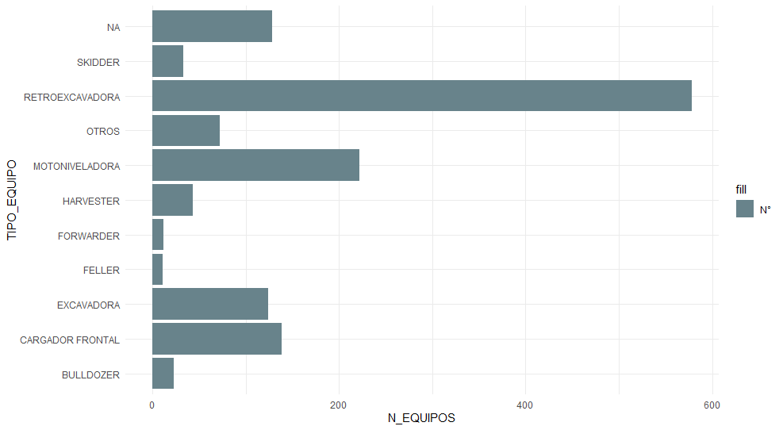
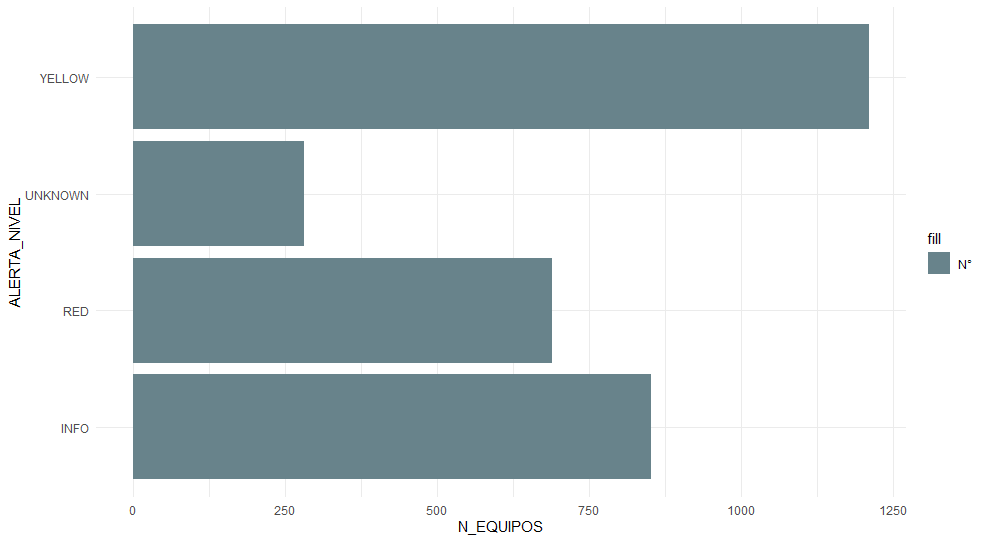

# Comprensión y Preparación de los Datos

### Recogida datos iniciales

Trabajaremos con las bases de datos de **SALFA**, que a groso modo contienen
información respecto del estado de los equipos en posesión de los
clientes. Para acotar el nuestro estudio, los datos a analizar
comprenderán los **equipos vendidos por SALFA de la marca John Deere entre
el año 2016 a 2020** con data generada en 2020.

### Instalación librerías
```r
    install.packages(c("tidyverse","readxl","janitor","skimr","lubridate","dplyr"))
```
```r
    library(tidyverse)
    library(readxl)
    library(janitor)
    library(skimr)
    library(lubridate)
    library(dplyr)
```

### Descripción de los datos

La primera fuente de datos llamada `Model Breakdown by PIN` es una
base que recopila información histórica de las alertas emitidas por los
equipos. En ella podemos encontrar códigos de falla, ID e equipo,
posición, categoría de la alerta, modelo, etc.

<table>
<colgroup>
<col style="width: 32%" />
<col style="width: 51%" />
<col style="width: 15%" />
</colgroup>
<thead>
<tr class="header">
<th>Encabezado columna</th>
<th>Descripción</th>
<th>Tipo de variable</th>
</tr>
</thead>
<tbody>
<tr class="odd">
<td>Decal Model Nm</td>
<td>Modelo del equipo</td>
<td>Categórica</td>
</tr>
<tr class="even">
<td>Alert Level</td>
<td>Nivel de alerta</td>
<td>Categórica</td>
</tr>
<tr class="odd">
<td>tla_spn_fmi</td>
<td>Id del código de falla</td>
<td>Categórica</td>
</tr>
<tr class="even">
<td>alert_defn_dsc</td>
<td>Descripción del código de falla</td>
<td>Categórica</td>
</tr>
<tr class="odd">
<td>dealer_name</td>
<td>Nombre de Dealer o comerciante</td>
<td>Categórica</td>
</tr>
<tr class="even">
<td>PIN Prefix</td>
<td>Id de procedencia u origen</td>
<td>Categórica</td>
</tr>
<tr class="odd">
<td>prod_line_nm</td>
<td>Nombre línea de producto</td>
<td>Categórica</td>
</tr>
<tr class="even">
<td>tier_level</td>
<td>Norma de emisión de gases</td>
<td>Categórica</td>
</tr>
<tr class="odd">
<td>TLA (Three Letter Abbreviation)</td>
<td>Grupo o categorización origen de falla</td>
<td>Categórica</td>
</tr>
<tr class="even">
<td>dealer_acct_id</td>
<td>Id de Dealer o comerciante</td>
<td>Categórica</td>
</tr>
<tr class="odd">
<td>first_cptr_tm</td>
<td>Fecha de activación del código</td>
<td>Fecha</td>
</tr>
<tr class="even">
<td>mfg_dt</td>
<td>Fecha activación de equipo a telemetría</td>
<td>Fecha</td>
</tr>
<tr class="odd">
<td>native_pin</td>
<td>Id del equipo</td>
<td>Categórica</td>
</tr>
<tr class="even">
<td>pin</td>
<td>Id (Abreviado) del equipo</td>
<td>Categórica</td>
</tr>
<tr class="odd">
<td>start_of_month</td>
<td>Mes referente al suceso de la falla</td>
<td>Fecha</td>
</tr>
<tr class="even">
<td>first_dtc_engn_hours</td>
<td>Horas de funcionamiento del equipo al momento de la falla</td>
<td>Cuantitativa</td>
</tr>
<tr class="odd">
<td>last_known_engn_hours</td>
<td>Horas de funcionamiento del equipo al momento de extracción de la
información</td>
<td>Cuantitativa</td>
</tr>
<tr class="even">
<td>last_known_lat</td>
<td>Última latitud conocida</td>
<td>Categórica</td>
</tr>
<tr class="odd">
<td>last_known_long</td>
<td>Última longitud conocida</td>
<td>Categórica</td>
</tr>
<tr class="even">
<td>sum_ocr_cnt</td>
<td>N° de ocurrencia de la falla</td>
<td>Cuantitativa</td>
</tr>
</tbody>
</table>

Existen algunas variables que a primera impresión, o desde una perspectiva intuitiva nos dan indicios que son sumamente importantes a la hora de realizar nuestro análisis y proyecto. Sin embargo, es necesario que entendamos si realmente lo son. 

Algunos ejemplos serían: 

- `Decal Model Nm`
- `Alert Level`
- `alert_defn_dsc`
- `prod_line_nm`
- `sum_ocr_cnt`

A modo introductorio es necesario entender que estos equipos de la marca John Deere, corresponden principalmente a maquinaria y tienen clasificaciones según sus tipos y funcionalidades. Algunas, corresponden a maquinarias forestales, otras agrícola y construcción. La variable específica que nos enseña el tipo de maquinaria es `prod_line_nm` y va aún más allá en cuánto a su clasificación genérica, las cuales mencioné anteriormente. A continuación mostraré un gráfico con las cantidades principales y a que me refiero con esta variable que será relevante y clasificadora:



Por otra parte, cuando uno de estos equipos es vendido se activa automáticamente la **telemetría**, que como bien hemos explicado anteriormente es la compartición de datos en línea del equipo, entra las que destacan horómetro, odómetro, posiciones (GPS), alertas, entre otras. 

A lo largo de este proyecto nos centraremos de manera exhaustiva en la variable `Alert Level`, ya que es aquella que nos informa en una primera instancia la salud del equipo. Los clientes de SALFA al recibir estas alertas tienen noción que algo deben revisar a su equipo, o bien hacer mantenciones o reparaciones, dependiendo el grado de complejidad. El área de telemetría dispone de esta información, sin embargo, es difícil tomar acciones proactivas, y el hecho de poder crear un modelo capaz de clasificar o predecir aquellos equipos que son propensos a fallas más graves, puedan ser contactados. 

Las alertas mencionadas anteriormente son:

- `UNKNOWN`: Alertas desconocidas. Puede ocurrir porque se activó algún sensor del equipo, por error, etc.
- `INFO`: Tipo de alerta menos urgente. Una Expert Alerts informativa indica que una máquina es elegible para un evento de servicio preventivo para garantizar el rendimiento de la máquina a largo plazo.
- `YELLOW`: Alerta de urgencia alta. Una Expert Alert alta indica que una máquina puede seguir funcionando, pero necesita atención de servicio pronto para que se mantenga operativa.
- `RED`: El tipo de alerta más urgente. Una Expert Alert crítica indica que una máquina necesita atención inmediata para que se mantenga operativa.



### Carga y preparación de los datos

```r
    base <- read_excel("databases/Model_Breakdown_by_PIN_11th_Digit_Full_Data_data.xlsx") %>% 
      clean_names()
```
```r
    print(base)
```

    ## # A tibble: 32,594 × 20
    ##    decal_model_nm alert_level tla_spn_fmi alert_defn_dsc    dealer_name pin_prefix prod_line_nm tier_level
    ##    <chr>          <chr>       <chr>       <chr>             <chr>       <chr>      <chr>        <chr>     
    ##  1 310L           YELLOW      PDU-2251.9  YELLOW   PDU 002… SALINAS Y … 1BZ        BACKHOE LOA… Non-Certi…
    ##  2 310L           YELLOW      PDU-2251.9  YELLOW   PDU 002… SALINAS Y … 1BZ        BACKHOE LOA… Non-Certi…
    ##  3 310L           YELLOW      PDU-2251.9  YELLOW   PDU 002… SALINAS Y … 1BZ        BACKHOE LOA… Non-Certi…
    ##  4 ZAXIS 210-5    INFO        ICZ-32000.2 INFO ICZ 32000.2… SALINAS Y … 1F9        EXCAVATORS … <NA>      
    ##  5 310L           INFO        ECU-97.3    INFO   ECU 00009… SALINAS Y … 1T0        BACKHOE LOA… NO ENGINE…
    ##  6 310L           INFO        ECU-97.3    INFO   ECU 00009… SALINAS Y … 1T0        BACKHOE LOA… NO ENGINE…
    ##  7 310L           INFO        ECU-97.3    INFO   ECU 00009… SALINAS Y … 1T0        BACKHOE LOA… NO ENGINE…
    ##  8 310L           INFO        ECU-97.3    INFO   ECU 00009… SALINAS Y … 1T0        BACKHOE LOA… NO ENGINE…
    ##  9 310L           INFO        ECU-97.3    INFO   ECU 00009… SALINAS Y … 1T0        BACKHOE LOA… NO ENGINE…
    ## 10 310L           INFO        ECU-97.3    INFO   ECU 00009… SALINAS Y … 1T0        BACKHOE LOA… NO ENGINE…
    ## # ℹ 32,584 more rows
    ## # ℹ 12 more variables: tla <chr>, dealer_acct_id <dbl>, first_cptr_tm <dttm>, mfg_dt <dttm>,
    ## #   native_pin <chr>, pin <chr>, start_of_month <dttm>, first_dtc_engn_hours <dbl>,
    ## #   last_known_engn_hours <dbl>, last_known_lat <dbl>, last_known_long <dbl>, sum_ocr_cnt <dbl>

Una vez cargada y comprendida cada variable de la base, seleccionamos
aquellas que utilizaremos y también las que no. Cabe señalar que
aquellas variables que no serán consideradas, será porque no aportan
información relevante para el objetivo del proyecto, porque es
información redundate, o porque técnicos expertos nos comentaron
específicamente a que corresponde cada variable. (Para mayor información
acerca de la eliminación de variables visitar el informe)

**Variables a considerar:**

-   `decal_model_nm`
-   `native_pin`
-   `alert_level` 
-   `pin_prefix`  
-   `prod_line_nm`  
-   `tla`  
-   `first_cptr_tm`  
-   `sum_ocr_cnt`
-   `first_dtc_engn_hours`

**Variables a excluir:**

-   `pin`
-   `dealer_name` / `dealer_acct_id`
-   `tier_level`
-   `start_of_month`
-   `last_known_lat` / `last_known_long`
-   `mfg_dt`
-   `last_known_engn_hours`

Por lo tanto, de esta base eliminaremos 9 variables y nos quedamos con
9. Las dos variables restantes asociadas a ID código de falla y
descripción código de falla (`alert_defn_dsc`, `tla_spn_fmi`)
también serán eliminadas.

A su vez, el equipo de telemetría dispone de otra fuente de datos
llamada `DESCRIPTIVOS EQUIPO JD` que recopila información descriptiva
y en línea de los equipos, de los cuales destacan variables como
horómetros, odómetros, o incluso fechas de facturación o de la última
mantención, dependiendo si han realizado las mantenciones en el
consesionario o no.

```r
    base_desc <- read_excel("databases/DESCRIPCTIVOS EQUIPO JD.xlsx") %>% 
      clean_names()
```
```r
    print(base_desc)
```

    ## # A tibble: 4,131 × 10
    ##    vin_equipo        fecha_facturacion   marca      modelo       tipo_maquina_nivel_2 tipo_maquina_nivel_3
    ##    <chr>             <dttm>              <chr>      <chr>        <chr>                <chr>               
    ##  1 1BZ310KXAGC000684 2016-07-25 00:00:00 JOHN DEERE JD RETRO 31… MAQ CONSTRUCCION     RETROEXCAVADORA     
    ##  2 1BZ310KXAGC000698 2016-08-10 00:00:00 JOHN DEERE JD RETRO 31… MAQ CONSTRUCCION     RETROEXCAVADORA     
    ##  3 1BZ310KXAGC000717 2016-09-26 00:00:00 JOHN DEERE JD RETRO 31… MAQ CONSTRUCCION     RETROEXCAVADORA     
    ##  4 1BZ310KXAGC000720 2016-09-07 00:00:00 JOHN DEERE JD RETRO 31… MAQ CONSTRUCCION     RETROEXCAVADORA     
    ##  5 1BZ310KXAGC000734 2016-12-01 00:00:00 JOHN DEERE JD RETRO 31… MAQ CONSTRUCCION     RETROEXCAVADORA     
    ##  6 1BZ310KXAGC000846 2016-11-30 00:00:00 JOHN DEERE JD RETRO 31… MAQ CONSTRUCCION     RETROEXCAVADORA     
    ##  7 1BZ310KXAGC000863 2017-01-27 00:00:00 JOHN DEERE JD RETRO 31… MAQ CONSTRUCCION     RETROEXCAVADORA     
    ##  8 1BZ310KXCGC000688 2016-06-30 00:00:00 JOHN DEERE JD RETRO 31… MAQ CONSTRUCCION     RETROEXCAVADORA     
    ##  9 1BZ310KXCGC000691 2016-08-04 00:00:00 JOHN DEERE JD RETRO 31… MAQ CONSTRUCCION     RETROEXCAVADORA     
    ## 10 1BZ310KXCGC000696 2016-08-12 00:00:00 JOHN DEERE JD RETRO 31… MAQ CONSTRUCCION     RETROEXCAVADORA     
    ## # ℹ 4,121 more rows
    ## # ℹ 4 more variables: mant_ult_fecha <dttm>, horometro <chr>, odometro <lgl>, n <dbl>

De esta base `DESCRIPTIVOS EQUIPO JD` consideraremos variables que
serán de interés para nuestro estudio, entre las cuales encontramos:

-   `vin_equipo`: ID del equipo.
-   `fecha_facturación`: Fecha de venta del equipo al cliente.
-   `tipo_maquinaria_nivel_2`: Segrega los equipos en tres grupos
    de camión, máquina construcción y forestal.
-   `mant_ult_fecha`: Fecha de la última mantención del equipo
    realizada en los servicios técnicos de SALFA.

Una vez analizada ambas bases, realizamos una integración de ambas por
`ID del equipo`, específicamente las variables `NATIVE_PIN` y
`VIN_EQUIPO` resultando una base de datos integrada denominada
`base_join` de **32.594 observaciones y 29 variables**.

```r
    base_join <- left_join(base, base_desc, by = c("native_pin" = "vin_equipo"))
```
```r
    print(base_join)
```

    ## # A tibble: 32,594 × 29
    ##    decal_model_nm alert_level tla_spn_fmi alert_defn_dsc    dealer_name pin_prefix prod_line_nm tier_level
    ##    <chr>          <chr>       <chr>       <chr>             <chr>       <chr>      <chr>        <chr>     
    ##  1 310L           YELLOW      PDU-2251.9  YELLOW   PDU 002… SALINAS Y … 1BZ        BACKHOE LOA… Non-Certi…
    ##  2 310L           YELLOW      PDU-2251.9  YELLOW   PDU 002… SALINAS Y … 1BZ        BACKHOE LOA… Non-Certi…
    ##  3 310L           YELLOW      PDU-2251.9  YELLOW   PDU 002… SALINAS Y … 1BZ        BACKHOE LOA… Non-Certi…
    ##  4 ZAXIS 210-5    INFO        ICZ-32000.2 INFO ICZ 32000.2… SALINAS Y … 1F9        EXCAVATORS … <NA>      
    ##  5 310L           INFO        ECU-97.3    INFO   ECU 00009… SALINAS Y … 1T0        BACKHOE LOA… NO ENGINE…
    ##  6 310L           INFO        ECU-97.3    INFO   ECU 00009… SALINAS Y … 1T0        BACKHOE LOA… NO ENGINE…
    ##  7 310L           INFO        ECU-97.3    INFO   ECU 00009… SALINAS Y … 1T0        BACKHOE LOA… NO ENGINE…
    ##  8 310L           INFO        ECU-97.3    INFO   ECU 00009… SALINAS Y … 1T0        BACKHOE LOA… NO ENGINE…
    ##  9 310L           INFO        ECU-97.3    INFO   ECU 00009… SALINAS Y … 1T0        BACKHOE LOA… NO ENGINE…
    ## 10 310L           INFO        ECU-97.3    INFO   ECU 00009… SALINAS Y … 1T0        BACKHOE LOA… NO ENGINE…
    ## # ℹ 32,584 more rows
    ## # ℹ 21 more variables: tla <chr>, dealer_acct_id <dbl>, first_cptr_tm <dttm>, mfg_dt <dttm>,
    ## #   native_pin <chr>, pin <chr>, start_of_month <dttm>, first_dtc_engn_hours <dbl>,
    ## #   last_known_engn_hours <dbl>, last_known_lat <dbl>, last_known_long <dbl>, sum_ocr_cnt <dbl>,
    ## #   fecha_facturacion <dttm>, marca <chr>, modelo <chr>, tipo_maquina_nivel_2 <chr>,
    ## #   tipo_maquina_nivel_3 <chr>, mant_ult_fecha <dttm>, horometro <chr>, odometro <lgl>, n <dbl>

Ahora haremos un **análisis exploratorio inicial** de los datos, para
ver las características de nuestras variables y hacer las modificaciones
necesarias:

```r
    str(base_join)
```

    ## tibble [32,594 × 29] (S3: tbl_df/tbl/data.frame)
    ##  $ decal_model_nm       : chr [1:32594] "310L" "310L" "310L" "ZAXIS 210-5" ...
    ##  $ alert_level          : chr [1:32594] "YELLOW" "YELLOW" "YELLOW" "INFO" ...
    ##  $ tla_spn_fmi          : chr [1:32594] "PDU-2251.9" "PDU-2251.9" "PDU-2251.9" "ICZ-32000.2" ...
    ##  $ alert_defn_dsc       : chr [1:32594] "YELLOW   PDU 002251.09    No CAN from MTG" "YELLOW   PDU 002251.09    No CAN from MTG" "YELLOW   PDU 002251.09    No CAN from MTG" "INFO ICZ 32000.2 Coolant Temperature Pre Alarm" ...
    ##  $ dealer_name          : chr [1:32594] "SALINAS Y FABRES S.A." "SALINAS Y FABRES S.A." "SALINAS Y FABRES S.A." "SALINAS Y FABRES S.A." ...
    ##  $ pin_prefix           : chr [1:32594] "1BZ" "1BZ" "1BZ" "1F9" ...
    ##  $ prod_line_nm         : chr [1:32594] "BACKHOE LOADERS" "BACKHOE LOADERS" "BACKHOE LOADERS" "EXCAVATORS (AMERICAS)" ...
    ##  $ tier_level           : chr [1:32594] "Non-Certified" "Non-Certified" "Non-Certified" NA ...
    ##  $ tla                  : chr [1:32594] "PDU" "PDU" "PDU" "ICZ" ...
    ##  $ dealer_acct_id       : num [1:32594] 282586 282586 282586 282586 282586 ...
    ##  $ first_cptr_tm        : POSIXct[1:32594], format: "2020-08-23 19:18:55" "2020-05-11 17:13:47" "2020-09-12 16:44:06" ...
    ##  $ mfg_dt               : POSIXct[1:32594], format: "2016-12-16" "2016-12-16" "2016-12-16" ...
    ##  $ native_pin           : chr [1:32594] "1BZ310LAKGC000009" "1BZ310LAKGC000009" "1BZ310LAKGC000009" "1F9DCDG1CKC330152" ...
    ##  $ pin                  : chr [1:32594] "BZ310LA000009" "BZ310LA000009" "BZ310LA000009" "F9DCDG1330152" ...
    ##  $ start_of_month       : POSIXct[1:32594], format: "2020-08-01" "2020-05-01" "2020-09-01" ...
    ##  $ first_dtc_engn_hours : num [1:32594] 5077 4764 5185 186 2753 ...
    ##  $ last_known_engn_hours: num [1:32594] 5354 5354 5354 2210 4231 ...
    ##  $ last_known_lat       : num [1:32594] -31.1 -31.1 -31.1 -32 -35.1 ...
    ##  $ last_known_long      : num [1:32594] -71.2 -71.2 -71.2 -71.1 -71.9 ...
    ##  $ sum_ocr_cnt          : num [1:32594] 2 1 1 9 66 145 142 136 157 153 ...
    ##  $ fecha_facturacion    : POSIXct[1:32594], format: "2017-07-25" "2017-07-25" "2017-07-25" ...
    ##  $ marca                : chr [1:32594] "JOHN DEERE" "JOHN DEERE" "JOHN DEERE" NA ...
    ##  $ modelo               : chr [1:32594] "JD RETRO 310L 4X4 A/A PALANCAS" "JD RETRO 310L 4X4 A/A PALANCAS" "JD RETRO 310L 4X4 A/A PALANCAS" NA ...
    ##  $ tipo_maquina_nivel_2 : chr [1:32594] "MAQ CONSTRUCCION" "MAQ CONSTRUCCION" "MAQ CONSTRUCCION" NA ...
    ##  $ tipo_maquina_nivel_3 : chr [1:32594] "RETROEXCAVADORA" "RETROEXCAVADORA" "RETROEXCAVADORA" NA ...
    ##  $ mant_ult_fecha       : POSIXct[1:32594], format: NA NA NA ...
    ##  $ horometro            : chr [1:32594] NA NA NA NA ...
    ##  $ odometro             : logi [1:32594] NA NA NA NA NA NA ...
    ##  $ n                    : num [1:32594] 1 1 1 NA 1 1 1 1 1 1 ...

```r
    summary(base_join)
```

    ##  decal_model_nm     alert_level        tla_spn_fmi        alert_defn_dsc     dealer_name       
    ##  Length:32594       Length:32594       Length:32594       Length:32594       Length:32594      
    ##  Class :character   Class :character   Class :character   Class :character   Class :character  
    ##  Mode  :character   Mode  :character   Mode  :character   Mode  :character   Mode  :character  
    ##                                                                                                
    ##                                                                                                
    ##                                                                                                
    ##                                                                                                
    ##   pin_prefix        prod_line_nm        tier_level            tla            dealer_acct_id  
    ##  Length:32594       Length:32594       Length:32594       Length:32594       Min.   :282165  
    ##  Class :character   Class :character   Class :character   Class :character   1st Qu.:282586  
    ##  Mode  :character   Mode  :character   Mode  :character   Mode  :character   Median :282586  
    ##                                                                              Mean   :282574  
    ##                                                                              3rd Qu.:282586  
    ##                                                                              Max.   :282586  
    ##                                                                                              
    ##  first_cptr_tm                        mfg_dt                        native_pin            pin           
    ##  Min.   :2020-01-01 00:11:16.00   Min.   :2011-06-14 00:00:00.00   Length:32594       Length:32594      
    ##  1st Qu.:2020-03-17 13:48:59.50   1st Qu.:2015-06-17 00:00:00.00   Class :character   Class :character  
    ##  Median :2020-07-01 02:50:54.50   Median :2017-06-13 00:00:00.00   Mode  :character   Mode  :character  
    ##  Mean   :2020-06-26 22:07:29.51   Mean   :2016-12-03 14:25:38.78                                        
    ##  3rd Qu.:2020-10-02 13:57:01.75   3rd Qu.:2018-06-07 00:00:00.00                                        
    ##  Max.   :2020-12-31 20:07:11.00   Max.   :2020-10-29 00:00:00.00                                        
    ##                                   NA's   :234                                                           
    ##  start_of_month                  first_dtc_engn_hours last_known_engn_hours last_known_lat  
    ##  Min.   :2020-01-01 00:00:00.0   Min.   :    0        Min.   :    3.73      Min.   :-54.94  
    ##  1st Qu.:2020-03-01 00:00:00.0   1st Qu.: 1876        1st Qu.: 3089.05      1st Qu.:-37.59  
    ##  Median :2020-07-01 00:00:00.0   Median : 4209        Median : 5587.40      Median :-35.61  
    ##  Mean   :2020-06-15 07:27:29.9   Mean   : 5308        Mean   : 6576.82      Mean   :-33.23  
    ##  3rd Qu.:2020-10-01 00:00:00.0   3rd Qu.: 8201        3rd Qu.: 9439.60      3rd Qu.:-27.46  
    ##  Max.   :2020-12-01 00:00:00.0   Max.   :74567        Max.   :43558.08      Max.   :  0.00  
    ##                                                                             NA's   :4       
    ##  last_known_long   sum_ocr_cnt       fecha_facturacion                   marca          
    ##  Min.   :-78.82   Min.   :    1.00   Min.   :2011-07-28 00:00:00.00   Length:32594      
    ##  1st Qu.:-72.69   1st Qu.:    1.00   1st Qu.:2016-07-25 00:00:00.00   Class :character  
    ##  Median :-71.67   Median :    3.00   Median :2018-04-25 00:00:00.00   Mode  :character  
    ##  Mean   :-71.37   Mean   :   66.51   Mean   :2017-10-19 22:55:01.64                     
    ##  3rd Qu.:-70.30   3rd Qu.:   12.00   3rd Qu.:2019-03-26 00:00:00.00                     
    ##  Max.   :  0.00   Max.   :17690.00   Max.   :2021-04-30 00:00:00.00                     
    ##  NA's   :4        NA's   :558        NA's   :2164                                       
    ##     modelo          tipo_maquina_nivel_2 tipo_maquina_nivel_3 mant_ult_fecha                  
    ##  Length:32594       Length:32594         Length:32594         Min.   :2019-01-09 00:00:00.00  
    ##  Class :character   Class :character     Class :character     1st Qu.:2019-09-30 00:00:00.00  
    ##  Mode  :character   Mode  :character     Mode  :character     Median :2020-08-31 00:00:00.00  
    ##                                                               Mean   :2020-06-26 15:14:30.85  
    ##                                                               3rd Qu.:2021-04-23 00:00:00.00  
    ##                                                               Max.   :2021-05-31 00:00:00.00  
    ##                                                               NA's   :19498                   
    ##   horometro         odometro             n       
    ##  Length:32594       Mode:logical   Min.   :1     
    ##  Class :character   NA's:32594     1st Qu.:1     
    ##  Mode  :character                  Median :1     
    ##                                    Mean   :1     
    ##                                    3rd Qu.:1     
    ##                                    Max.   :1     
    ##                                    NA's   :2164

Como se mencionó anteriormente, existen variables que no aportan
información relevante para la prediccion de fallas en los equipos y no
serán consideradas, por lo que las eliminaremos. Además, modificaremos
el formato de las variables que requieren cambios, como fechas en
formato `POSIXct`, etc.

**Datos modificados**
-	`first_cptr_tm` / `fecha_facturacion`: inicialmente ambas variables estaban quedando en formato "POSIXct", se realizó la modificación a formato fecha.

**Datos creados**
-	`mantencion_previa`: se crea esta variable utilizando la columna “mant_ult_fecha”, esta nueva variable tiene formato factor y contiene: los grupos: “si” y “no”, el propósito de la variable es determinar si existe relación entre las fallas reportadas para equipos con y sin mantención previa en SALFA. 
-	`año_facturacion`: se crea esta variable utilizando la columna “fecha_facturación”, esta nueva variable es categórica y contiene el año de venta del equipo, el propósito de esta variable es determinar si existe relación entre la antigüedad del equipo y las fallas. 

Guardaremos esta nueva base en un objeto llamado `base_join2`:

```r
    base_join2 <- base_join %>% 
      mutate(MFG_DT = ymd(mfg_dt)) %>% 
      separate(col = first_cptr_tm, into = c("first_cptr_tm", 
                                             "hour_first_cptr_tm"),
               convert = TRUE, sep = " ") %>% 
      mutate(first_cptr_tm = ymd(first_cptr_tm)) %>% 
      mutate(fecha_facturacion = ymd(fecha_facturacion)) %>% 
      mutate("año_facturacion" = as.character(format(fecha_facturacion, "%Y"))) %>% 
      mutate("fecha_mantencion" = as.character(format(mant_ult_fecha, "%Y"))) %>% 
      mutate(mantencion_previa = factor(case_when(fecha_mantencion == "2019" ~ "Si", 
                                                  fecha_mantencion == "2020" ~ "Si",
                                                  TRUE ~ "No"))) %>% 
      select(-dealer_acct_id, -pin, -tier_level, -dealer_name, -start_of_month, 
             -last_known_lat, -last_known_long, -mfg_dt, -hour_first_cptr_tm, 
             -last_known_engn_hours, -tla_spn_fmi, -fecha_mantencion, -mant_ult_fecha,
             -fecha_facturacion, -marca, -modelo, -tipo_maquina_nivel_3, -horometro, -odometro,
             -n)
```
```r
    print(base_join2)
```

    ## # A tibble: 32,594 × 14
    ##    decal_model_nm alert_level alert_defn_dsc        pin_prefix prod_line_nm tla   first_cptr_tm native_pin
    ##    <chr>          <chr>       <chr>                 <chr>      <chr>        <chr> <date>        <chr>     
    ##  1 310L           YELLOW      YELLOW   PDU 002251.… 1BZ        BACKHOE LOA… PDU   2020-08-23    1BZ310LAK…
    ##  2 310L           YELLOW      YELLOW   PDU 002251.… 1BZ        BACKHOE LOA… PDU   2020-05-11    1BZ310LAK…
    ##  3 310L           YELLOW      YELLOW   PDU 002251.… 1BZ        BACKHOE LOA… PDU   2020-09-12    1BZ310LAK…
    ##  4 ZAXIS 210-5    INFO        INFO ICZ 32000.2 Coo… 1F9        EXCAVATORS … ICZ   2020-01-21    1F9DCDG1C…
    ##  5 310L           INFO        INFO   ECU 000097.03… 1T0        BACKHOE LOA… ECU   2020-07-10    1T0310LXC…
    ##  6 310L           INFO        INFO   ECU 000097.03… 1T0        BACKHOE LOA… ECU   2020-08-03    1T0310LXC…
    ##  7 310L           INFO        INFO   ECU 000097.03… 1T0        BACKHOE LOA… ECU   2020-09-01    1T0310LXC…
    ##  8 310L           INFO        INFO   ECU 000097.03… 1T0        BACKHOE LOA… ECU   2020-10-01    1T0310LXC…
    ##  9 310L           INFO        INFO   ECU 000097.03… 1T0        BACKHOE LOA… ECU   2020-11-02    1T0310LXC…
    ## 10 310L           INFO        INFO   ECU 000097.03… 1T0        BACKHOE LOA… ECU   2020-12-01    1T0310LXC…
    ## # ℹ 32,584 more rows
    ## # ℹ 6 more variables: first_dtc_engn_hours <dbl>, sum_ocr_cnt <dbl>, tipo_maquina_nivel_2 <chr>,
    ## #   MFG_DT <date>, año_facturacion <chr>, mantencion_previa <fct>

Finalmente, nuestra fuente de datos “base” de trabajo para el proyecto
será ésta denominada `base_join2`, la cual cuenta con **32.594
observaciones y 14 variables**.
