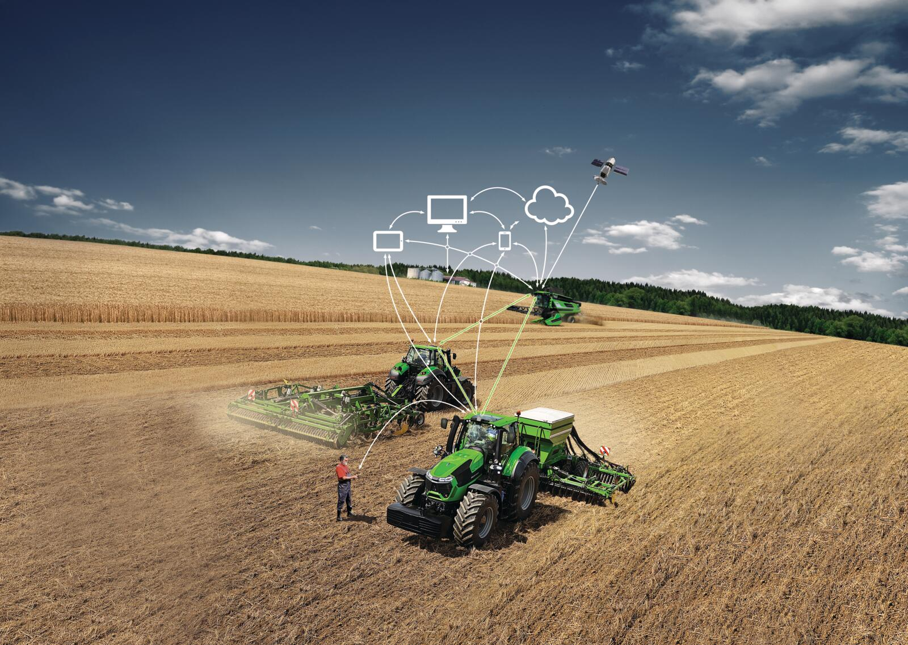

# Predicción y Clasificación de Fallas en Maquinarias con Machine Learning

## 📝 Contexto

Salinas y Fabres S.A. (SALFA S.A.) es una empresa chilena dedicada a la venta y prestación de servicios de vehículos livianos, camiones, maquinaria, motores industriales, partes y accesorios. Dentro de la Gerencia de Post Venta, se administra un área de telemetría que centraliza información operativa sobre los equipos vendidos, garantizando su correcto funcionamiento.

El proyecto surge como respuesta a un desafío clave: la ausencia de estrategias proactivas basadas en datos telemétricos para gestionar fallas en equipos y mejorar el servicio post venta.

## 📋 Descripción del Proyecto

Este proyecto utiliza herramientas de Machine Learning para procesar datos telemétricos de equipos John Deere vendidos entre 2016 y 2020, con el fin de predecir y clasificar fallas en maquinarias. A partir de los insights generados, se busca implementar acciones comerciales proactivas para fortalecer la relación con los clientes y potenciar la efectividad de los servicios post venta.

**Es por esto, que la ruta correcta para ver este proyecto es:**

## 🎯 Ojetivo del Proyecto

El objetivo de este proyecto es transformar los datos telemétricos de SALFA en un recurso estratégico que permita predecir fallas en equipos mediante modelos de Machine Learning, clasificar alertas críticas para tomar decisiones comerciales informadas y optimizar la gestión comercial y de post venta, priorizando clientes y equipos con mayor riesgo de falla.

## 💡 Desarrollo del Proyecto
El proyecto se desarrolló en las siguientes fases:

**Fase 1: Comprensión del negocio**
- Análisis del flujo de trabajo en la Gerencia de Post Venta.
- Identificación de problemas clave: acciones reactivas frente a fallas, baja explotación de datos telemétricos.
  
**Fase 2: Comprensión y preparación de los dato**

- Se utilizaron datos de telemetría de equipos vendidos de la marca John Deere (2016-2020).
- La base inicial incluía 32,594 registros y 20 variables; tras limpieza y depuración, se redujo a 29,308 registros y 14 variables relevantes.
- Identificación de variables clave: modelo del equipo, nivel de alerta, categoría de falla, horas de funcionamiento al momento de la falla, entre otras.

**Fase 3: Creación del modelo**

- Preparación de datos: Integración con bases adicionales, gestión de valores nulos y atípicos.
- Análisis exploratorio: Identificación de patrones en fallas según antigüedad, tipo de equipo y frecuencia de mantenciones previas.
- Modelado predictivo: Se aplicaron modelos supervisados para clasificar fallas y estimar probabilidad de ocurrencia.

**Fase 4: Validación**
- Validación cruzada de los modelos para garantizar resultados consistentes.
- Métricas de evaluación: exactitud, sensibilidad, curva ROC, entre otros.
  
**Fase 5: Generación de informe y presentación académica**
- Elaboración de un informe técnico detallado que describe el proceso, análisis y resultados del proyecto.
- Presentación académica para compartir los aprendizajes, destacando el uso de Machine Learning en el contexto industrial y la propuesta de soluciones proactivas para la gestión post venta.

## 📝 Conclusiones del proyecto

El análisis realizado ha permitido concluir que los datos telemétricos de los equipos pueden ser aprovechados para una gestión post venta más proactiva. Al predecir y clasificar las fallas en los equipos, es posible identificar con mayor precisión los equipos y clientes que requieren intervención, lo que facilita la toma de decisiones comerciales informadas. Además, se identificaron oportunidades clave para que el equipo comercial se enfoque en los clientes que no realizan mantenciones regulares, especialmente en el caso de las maquinarias de construcción. Esto abre nuevas vías para ofrecer servicios técnicos y aumentar la retención de clientes.

La utilización de la telemetría también ha optimizado la asignación de servicios técnicos, permitiendo dirigir las intervenciones hacia los equipos ubicados cerca de los centros de servicio, lo que mejora la eficiencia logística. Finalmente, los métodos aplicados en este proyecto son escalables y podrían extenderse a otras líneas de negocio dentro de SALFA, lo que brinda un alto potencial para la expansión de esta iniciativa.

