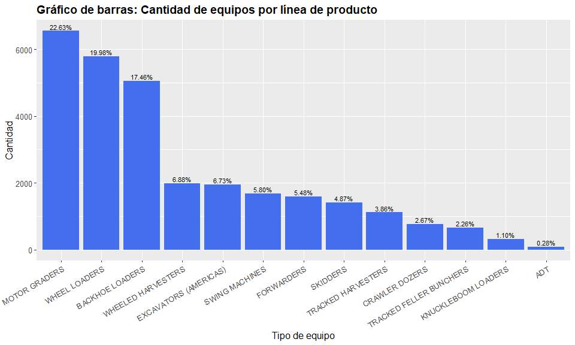

# Estadísticos descriptivos

Una vez con nuestra base completamente limpia, sin valores nulos u
outliers, procedemos a ver los estadísticos descriptivos por variable.
Recordemos que aún tenemos 14 variables, por lo que el resultado
mostrado por la consola podría ser algo extenso, pero nos dará una
visión más clara de sus estadísticos.

Esto lo hacemos con el fin de poder entender profundamente los valores
de las variables que disponemos:

```r
    Hmisc::describe(base_limpia)
```

    ## base_limpia 
    ## 
    ##  14  Variables      28967  Observations
    ## ----------------------------------------------------------------------------------------------------------
    ## decal_model_nm 
    ##        n  missing distinct 
    ##    28967        0       63 
    ## 
    ## lowest : 1050K       1270E       1270G       130G        1470E      
    ## highest: 859M        859MH       872G        959ML       ZAXIS 470-5
    ## ----------------------------------------------------------------------------------------------------------
    ## alert_level 
    ##        n  missing distinct 
    ##    28967        0        4 
    ##                                           
    ## Value         INFO     RED UNKNOWN  YELLOW
    ## Frequency    11039    3202     957   13769
    ## Proportion   0.381   0.111   0.033   0.475
    ## ----------------------------------------------------------------------------------------------------------
    ## alert_defn_dsc 
    ##        n  missing distinct 
    ##    28967        0     2541                                                          
    ## ----------------------------------------------------------------------------------------------------------
    ## pin_prefix 
    ##        n  missing distinct 
    ##    28967        0        7 
    ##                                                     
    ## Value        1BZ   1DW   1F9   1FF   1T0   1WJ   HCM
    ## Frequency   4634 12190  1910  1709  4934  3579    11
    ## Proportion 0.160 0.421 0.066 0.059 0.170 0.124 0.000
    ## ----------------------------------------------------------------------------------------------------------
    ## prod_line_nm 
    ##        n  missing distinct 
    ##    28967        0       13 
    ## 
    ## lowest : ADT                     BACKHOE LOADERS         CRAWLER DOZERS          EXCAVATORS (AMERICAS)   FORWARDERS             
    ## highest: SWING MACHINES          TRACKED FELLER BUNCHERS TRACKED HARVESTERS      WHEEL LOADERS           WHEELED HARVESTERS     
    ## ----------------------------------------------------------------------------------------------------------
    ## tla 
    ##        n  missing distinct 
    ##    28967        0       56 
    ## 
    ## lowest : ACL ACR ADU ALC ALS, highest: VCU VPC VSS WAB WAC
    ## ----------------------------------------------------------------------------------------------------------
    ## first_cptr_tm 
    ##          n    missing   distinct       Info       Mean    pMedian        Gmd        .05        .10 
    ##      28967          0        366          1 2020-06-24      18438      125.9 2020-01-12 2020-02-01 
    ##        .25        .50        .75        .90        .95 
    ## 2020-03-16 2020-06-28 2020-10-01 2020-11-25 2020-12-09 
    ## 
    ## lowest : 2020-01-01 2020-01-02 2020-01-03 2020-01-04 2020-01-05
    ## highest: 2020-12-27 2020-12-28 2020-12-29 2020-12-30 2020-12-31
    ## ----------------------------------------------------------------------------------------------------------
    ## native_pin 
    ##        n  missing distinct 
    ##    28967        0     1234 
    ## 
    ## lowest : 1BZ310KXAGC000684 1BZ310KXAGC000720 1BZ310KXAGC000846 1BZ310KXAGC000863 1BZ310KXCGC000858
    ## highest: 1WJ1910EPFC001427 1WJ1910EPJC001677 HCMJACK0E00051755 HCMJACK0K00051695 HCMJACK0V00051751
    ## ----------------------------------------------------------------------------------------------------------
    ## first_dtc_engn_hours 
    ##        n  missing distinct     Info     Mean  pMedian      Gmd      .05      .10      .25      .50 
    ##    28967        0    18793        1     5261     4920     4637    180.7    634.5   1870.1   4153.8 
    ##      .75      .90      .95 
    ##   8114.2  11845.2  13183.8 
    ## 
    ## lowest : 5       5.1     5.2     5.21667 5.25   , highest: 18430.4 18433.2 18433.4 18448.1 18468.2
    ## ----------------------------------------------------------------------------------------------------------
    ## sum_ocr_cnt 
    ##        n  missing distinct     Info     Mean  pMedian      Gmd      .05      .10      .25      .50 
    ##    28967        0      969    0.951    66.59      5.5    122.2        1        1        1        3 
    ##      .75      .90      .95 
    ##       12       86      221 
    ## 
    ## lowest :     1     2     3     4     5, highest: 15686 15916 16228 17141 17690
    ## ----------------------------------------------------------------------------------------------------------
    ## tipo_maquina_nivel_2 
    ##        n  missing distinct 
    ##    28967        0        2 
    ##                                             
    ## Value      MAQ CONSTRUCCION     MAQ FORESTAL
    ## Frequency             19878             9089
    ## Proportion            0.686            0.314
    ## ----------------------------------------------------------------------------------------------------------
    ## MFG_DT 
    ##          n    missing   distinct       Info       Mean    pMedian        Gmd        .05        .10 
    ##      28967          0        646          1 2017-01-02      17240      843.6 2012-06-07 2014-01-01 
    ##        .25        .50        .75        .90        .95 
    ## 2015-07-23 2017-06-22 2018-06-21 2019-04-08 2019-07-26 
    ## 
    ## lowest : 2011-07-07 2011-07-08 2011-07-13 2011-07-20 2011-08-18
    ## highest: 2020-09-04 2020-09-10 2020-09-21 2020-10-15 2020-10-29
    ## ----------------------------------------------------------------------------------------------------------
    ## año_facturacion 
    ##        n  missing distinct 
    ##    28967        0       10 
    ##                                                                       
    ## Value       2011  2012  2013  2014  2015  2016  2017  2018  2019  2020
    ## Frequency    546   964   541   679  2991  1937  5697  6645  6207  2760
    ## Proportion 0.019 0.033 0.019 0.023 0.103 0.067 0.197 0.229 0.214 0.095
    ## ----------------------------------------------------------------------------------------------------------
    ## mantencion_previa 
    ##        n  missing distinct 
    ##    28967        0        2 
    ##                       
    ## Value         No    Si
    ## Frequency  20834  8133
    ## Proportion 0.719 0.281
    ## ----------------------------------------------------------------------------------------------------------

### Análisis **first_dtc_engn_hours**:

A lo largo del proyecto hemos investigado la importancia de ciertas
variables y cómo éstas podrían ayudarnos a la predicción de fallas. Dado
esto, a continuación analizaremos exhaustivamente la variable
`first_dtc_engn_hours` (Horas de funcionamiento del equipo al momento de
la falla). Para esto, en primer lugar veremos la asimetría de los datos
de nuestra base:

-   `Coeficiente de asimetría`:

<!-- -->
```r
    psych::skew(base_limpia$first_dtc_engn_hours)
```
    ## [1] 0.7957582

-   `Curtosis`:

<!-- -->
```r
    psych::kurtosi(base_limpia$first_dtc_engn_hours)
```
    ## [1] -0.25132

-   `Cuantiles`:

<!-- -->
```r
    quantile(base_limpia$first_dtc_engn_hours, prob = seq(0, 1, 0.25))
```
    ##       0%      25%      50%      75%     100% 
    ##     5.00  1870.05  4153.80  8114.20 18468.18
```r
    base_limpia %>%
      group_by(año_facturacion) %>% # Agrupar por el campo año_facturacion
      summarise(
        Min = min(first_dtc_engn_hours, na.rm = TRUE),
        Q1 = quantile(first_dtc_engn_hours, probs = 0.25, na.rm = TRUE),
        Q2 = quantile(first_dtc_engn_hours, probs = 0.50, na.rm = TRUE), # Mediana
        Q3 = quantile(first_dtc_engn_hours, probs = 0.75, na.rm = TRUE),
        Max = max(first_dtc_engn_hours, na.rm = TRUE),
        Media = mean(first_dtc_engn_hours, na.rm = TRUE),
        `Desv. Estándar` = sd(first_dtc_engn_hours, na.rm = TRUE),
        `Coef. Asimetría` = psych::skew(first_dtc_engn_hours, na.rm = TRUE),
        Curtosis = psych::kurtosi(first_dtc_engn_hours, na.rm = TRUE))
```
    ## # A tibble: 10 × 10
    ##    año_facturacion    Min     Q1     Q2     Q3    Max  Media `Desv. Estándar` `Coef. Asimetría` Curtosis
    ##    <chr>            <dbl>  <dbl>  <dbl>  <dbl>  <dbl>  <dbl>            <dbl>             <dbl>    <dbl>
    ##  1 2011            1952.  8266.  10448. 12315. 14365. 10117.            2715.            -0.820    1.05 
    ##  2 2012            4263.  8359.   9295. 11222. 16863.  9726.            2635.             0.243    0.423
    ##  3 2013            4882.  8791.  10856. 13334. 14911. 10586.            2895.            -0.442   -0.815
    ##  4 2014             244.  8135.   9174. 11840. 17205.  9808.            2548.             0.405    0.432
    ##  5 2015               6.4 8589.  12271. 13811. 18468. 11506.            3539.            -0.368   -0.217
    ##  6 2016            1385.  7008.  10637  11758. 14592.  9391.            3159.            -0.665   -0.679
    ##  7 2017             137.  3662.   5669.  7707. 14282.  5748.            2594.             0.366   -0.279
    ##  8 2018              12.4 2385.   3587.  4886  10142.  3848.            1988.             0.852    0.543
    ##  9 2019               7.9  957.   1750.  2938.  6921.  2049.            1374.             0.738   -0.169
    ## 10 2020               5     17.2   290.   857.  2547.   536.             635.             1.23     0.495


En los histogramas se puede visualizar con mayor detalle la distribución
de la variable`first_dtc_engn_hour`, y en compañía de los indicadores
presentados en la tabla previa se puede obtener una clara interpretación
para cada año.

A modo de ejemplo para el año 2019 observamos que las horas de
funcionamiento al momento de la falla van desde las **7,9 hrs – 6.921,2
hrs**, presentan una distribución asimétrica a la derecha (positiva), y
por medio de la curtosis se puede decir que existe una leve tendencia a
que los datos se concentren de forma normal en torno a la media de
2.048,6 horas.

### Análisis **prod_line_nm**:

Por otra parte, y ya mencionado al inicio del proyecto. La variable
`prod_line_nm` (Nombre línea de producto) nos categoriza los distintos
tipos de maquinaria existente y es importante comprender su distribución
para ver a que clasificación de equipos corresponden mayormente los
tipos de alertas.
```r
    conteo_prod <-  base_limpia %>% 
      group_by(prod_line_nm) %>% 
      count() %>% 
      mutate(prop = n / nrow(base_limpia)) 
```
```r
    print(conteo_prod)
```
    ## # A tibble: 13 × 3
    ## # Groups:   prod_line_nm [13]
    ##    prod_line_nm                n    prop
    ##    <chr>                   <int>   <dbl>
    ##  1 ADT                        81 0.00280
    ##  2 BACKHOE LOADERS          5059 0.175  
    ##  3 CRAWLER DOZERS            772 0.0267 
    ##  4 EXCAVATORS (AMERICAS)    1950 0.0673 
    ##  5 FORWARDERS               1587 0.0548 
    ##  6 KNUCKLEBOOM LOADERS       319 0.0110 
    ##  7 MOTOR GRADERS            6554 0.226  
    ##  8 SKIDDERS                 1411 0.0487 
    ##  9 SWING MACHINES           1680 0.0580 
    ## 10 TRACKED FELLER BUNCHERS   655 0.0226 
    ## 11 TRACKED HARVESTERS       1118 0.0386 
    ## 12 WHEEL LOADERS            5789 0.200  
    ## 13 WHEELED HARVESTERS       1992 0.0688



Del gráfico anterior podemos ver la proporción que tiene cada línea de
producto de maquinaria, que a día de hoy han presentado algún tipo de
alerta a telemetría. Estas líneas de producto pertenecen a un tipo de
maquinaria (construcción, forestal), que son clasificados por la
variable `tipo_maquina_nivel_2`.

### Análisis **tipo_maquina_nivel_2** vs **mantencion_previa**:

En el siguiente recuadro se presentará un análisis de las variables
`tipo_maquina_nivel_2` y `mantencion_previa` con el objetivo de ver a
grandes rasgos, que tipos y cantidades de maquinaria construcción y
forestal, realizan mantenciones previas en SALFA.

```r
    gmodels::CrossTable(base_limpia$tipo_maquina_nivel_2, base_limpia$mantencion_previa,
                        prop.t = F, prop.chisq = F, 
                        dnn = c("Tipo de Máquina", "¿Mantención previa?"))
```

    ## Total Observations in Table:  28967 
    ## 
    ##                  | ¿Mantención previa? 
    ##  Tipo de Máquina |        No |        Si | Row Total | 
    ## -----------------|-----------|-----------|-----------|
    ## MAQ CONSTRUCCION |     16673 |      3205 |     19878 | 
    ##                  |     0.839 |     0.161 |     0.686 | 
    ##                  |     0.800 |     0.394 |           | 
    ## -----------------|-----------|-----------|-----------|
    ##     MAQ FORESTAL |      4161 |      4928 |      9089 | 
    ##                  |     0.458 |     0.542 |     0.314 | 
    ##                  |     0.200 |     0.606 |           | 
    ## -----------------|-----------|-----------|-----------|
    ##     Column Total |     20834 |      8133 |     28967 | 
    ##                  |     0.719 |     0.281 |           | 
    ## -----------------|-----------|-----------|-----------|


En términos generales se puede decir que el **71,9%** de los equipos que
reportaron un cierto nivel de alerta durante 2020 no contaban con una
mantención previa realizada en algún servicio técnico de **SALFA**.
Adicionalmente se puede indicar que las máquinas de construcción son las
que tienen una mayor presencia en nuestra data, siendo a su vez, el tipo
de maquinaria que menor proporción de mantención previa, **39,4% v/s
60,6%** de las maquinarias de tipo forestal.

### Análisis **sum_ocr_cnt**:

El número de ocurrencias de falla es una variable que suma la cantidad
de fallas registradas asociadas a un número o ID de equipo, es decir, es
una frecuencia acumulada. Dado esto, es que crearemos un `dataframe`
para reflejar la cantidad de veces que se registra una falla para un
cierto nivel de alerta.
```r
    frecuencia_fallas <- base_limpia %>% 
                          group_by(alert_level, tla, prod_line_nm, año_facturacion) %>% 
                           summarise(n = n())
```
 

De éste gráfico, podemos interpretar que para equipos entre los años **2017
y 2020** existe un mayor nivel de alertas. Esto conversando con las
áreas técnicas respectivas, hace sentido, ya que equipos más nuevos
tienen una mayor cantidad de sensores y tecnologías que podrían estar
dando avisos informativos o preventivos de manera frecuente. Es posible
ver que la mayor cantidad se concentra en alertas **UNKNOWN** y
**YELLOW**.

En paralelo, equipos del año 2015 presentan un nivel relativamente alto
de alertas. Esto es atribuido a la cantidad o vida útil al momento del
análisis (5 años después de su compra), indicando mayormente alertas
preventivas producto de mantenciones próximas necesarias.

Este análisis descriptivo inicial nos sirve para dar respuesta a algunas
de las interrogantes planteadas al inicio del proyecto:

-   **¿Se puede hacer gestión comercial a partir de los datos?**

Si, dado que existe un grupo importante de equipos que no realizan su
mantención en los servicios técnicos de SALFA, y esta ventana puede
convertirse en una oportunidad para que el equipo comercial centre sus
acciones en las maquinarias de tipo construcción.

-   **¿Podemos utilizar la telemetría para realizar gestión post
    venta?**

Si, pues los servicios de telemetría nos permiten conocer la ubicación
exacta de los equipos y con esto las propuestas comerciales se pueden
asignar al servicio técnico más cercano a la ubicación del equipo.
