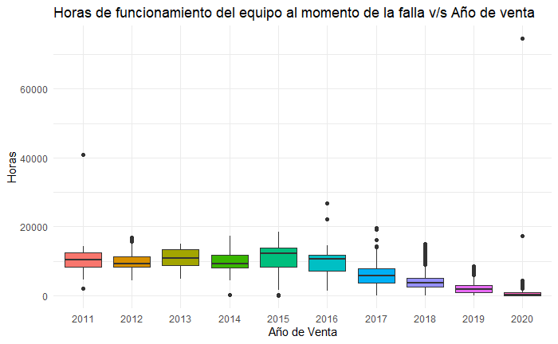
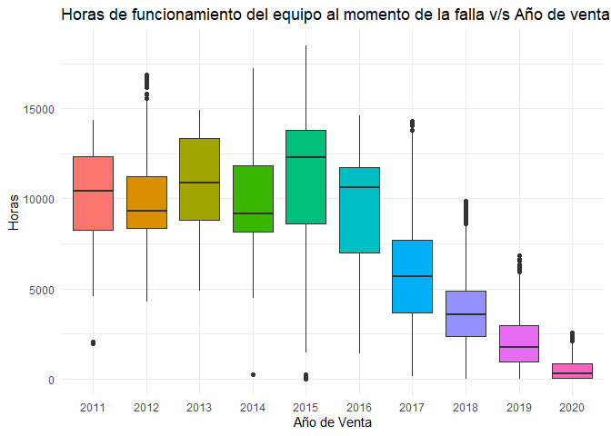

# Gestión de Outliers

### Visualización Outliers

Generaremos un gráfico de cajas (boxplot) entre las variables
`año_facturacion` (año de venta) y `first_dtc_engn_hours` (horas de
funcionamiento del equipo al momento de la falla), ambas variables
relevantes a la hora de analizar la problemática planteada en el
proyecto, que es identificar los elementos que aportan al momento de
predecir fallas. En el boxplot se visualiza la distribución de nuestros
datos, los valores destacados podrían reconocerse como datos atípicos
que se deben gestionar.



Detección: Con el fin de detectar los registros atípicos presentes en
cada caja, para objetivos de nuestro estudio definiremos como valor
atípico alto a todo aquel registro que supere el resultado de aplicar la
siguiente formula:

*Valor Atípico Alto = Q1 + IQR * 3*

Donde:

-   Q1 (primer cuantil): representa la agrupación del 25% de los datos.
-   IQR (rango intercuantil): diferencia existente entre el tercer
    cuantil (agrupación del 75% de los datos) v/s el primer cuantil
    (agrupación del 25% de los datos).

Respecto de los valores atípicos bajos, por regla de negocio
comprenderán todos aquellos registros con menos de 5 horas de
funcionamiento al momento de la falla.

*Valor Atípico Bajo = first_dtc_engn_hours &lt; 5*

Primero, definimos en el objeto `años`, los distintos valores únicos
de la variable `año_facturacion`:

```r
    años <- unique(base_limpia$año_facturacion)
```

Luego, creamos dos objetos para almacenar valores respecto a los
atípicos altos:

1.  `atipicos`: Almacenará los resultados relacionados a la condición de
    valor atípico alto para cada año, es decir, el umbral o punto de
    corte para que sea considerado atípico alto.
2.  `pos_atipicos_altos`: Almacenará los resultados relacionados a las
    posiciones en nuestra base respecto a la condición anterior, para
    posteriormente contar los valores atípicos altos.

<!-- -->
```r
    atipicos <- list()

    pos_atipicos_altos <- list()
```
```r
    for (i in años) {
      # Filtrar datos del año actual
      datos_año <- base_limpia %>% filter(año_facturacion == i) %>% pull(first_dtc_engn_hours)
      
      # Calcular valor atípico
      atipico <- quantile(datos_año, prob = 0.25) + IQR(datos_año) * 3
      atipicos[[as.character(i)]] <- atipico
      
      # Obtener posiciones de los valores atípicos
      pos_atipicos_altos[[as.character(i)]] <- which(base_limpia$año_facturacion == i & base_limpia$first_dtc_engn_hours > atipico)
    }
```

Una vez creado nuestro ciclo `for` y ya con nuestras listas almacenadas en
los objetos creados, podemos contar nuestros valores atípicos altos por
año, y luego sumarlos para ver el total:

```r
    conteo_atipicos_altos <- vapply(pos_atipicos_altos, length, numeric(1))

    print(conteo_atipicos_altos)
```

    ## 2017 2018 2019 2012 2013 2014 2020 2015 2016 2011 
    ##    0   27    2    0    0    0    1    0    0    0

```r
    total_atipicos_altos <- sum(conteo_atipicos_altos)

    print(total_atipicos_altos)
```

    ## [1] 30

Podemos ver que existen **275 valores atípicos altos**. Es decir, de nuestra
`base_limpia` de **29.412 observaciones**, existen 275 que son mayores que
`Q1 + IQR \* 3`. Ahora, haremos lo mismo para los valores atípicos bajos,
con la condición que la horas de funcionamiento de falla de motor sean
menores a 5 (`first_dtc_engn_hours &lt; 5`).

```r
    pos_atipicos_bajos <- which(base_limpia$first_dtc_engn_hours < 5)

    total_atipicos_bajos <- length(pos_atipicos_bajos)

    print(total_atipicos_bajos)
```
    ## [1] 0
    
```r
    sum(total_atipicos_altos, total_atipicos_bajos)
```
    ## [1] 30

Luego de aplicar las reglas señaladas en el punto precedente, se
identificó un total de **445 registros atípicos**, siendo **275 registros
valores atípicos altos** y **170 valores atípicos bajos**. La decisión a
continuación, será prescindir de estos datos para no alterar el
análisis.

```r
    pos_atipicos_altos <- unlist(pos_atipicos_altos)

    pos_atipicos <- c(pos_atipicos_altos, pos_atipicos_bajos)

    base_limpia <- base_limpia %>% slice(-pos_atipicos)
```

Finalmente, luego de gestionar los valores nulos y outliers la base de
datos queda con un formato de **28.967 filas y 14 columnas**.

En el siguiente boxplot a continuación, se observan los resultados
obtenidos al gestionar los valores atípicos. A grandes rasgos se aprecia
que desde el año 2015 en adelante la dispersión de los datos va
decreciendo, lo cual tiene lógica considerando que equipos más antiguos
poseen mayor número de horas trabajadas, respecto del rango se observa
una mayor variabilidad en ciertos años (2015 y 2017) lo cual puede
encontrar su fundamento en mayores observaciones (frecuencia de fallas)
para esos años.


